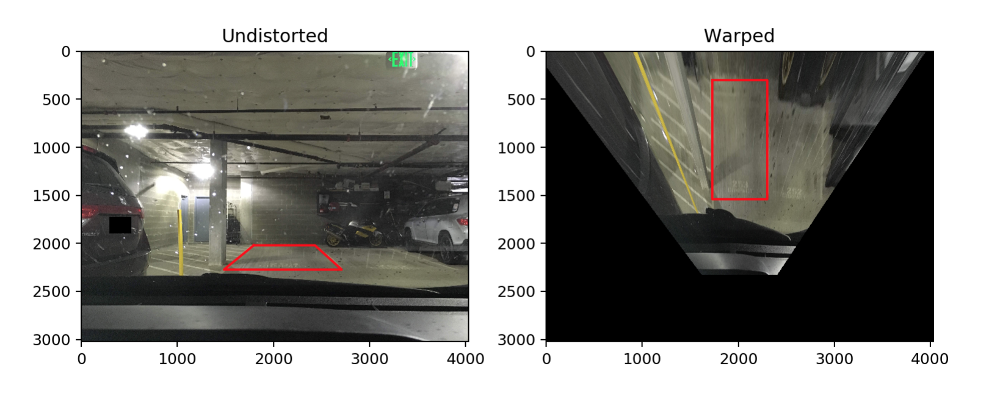
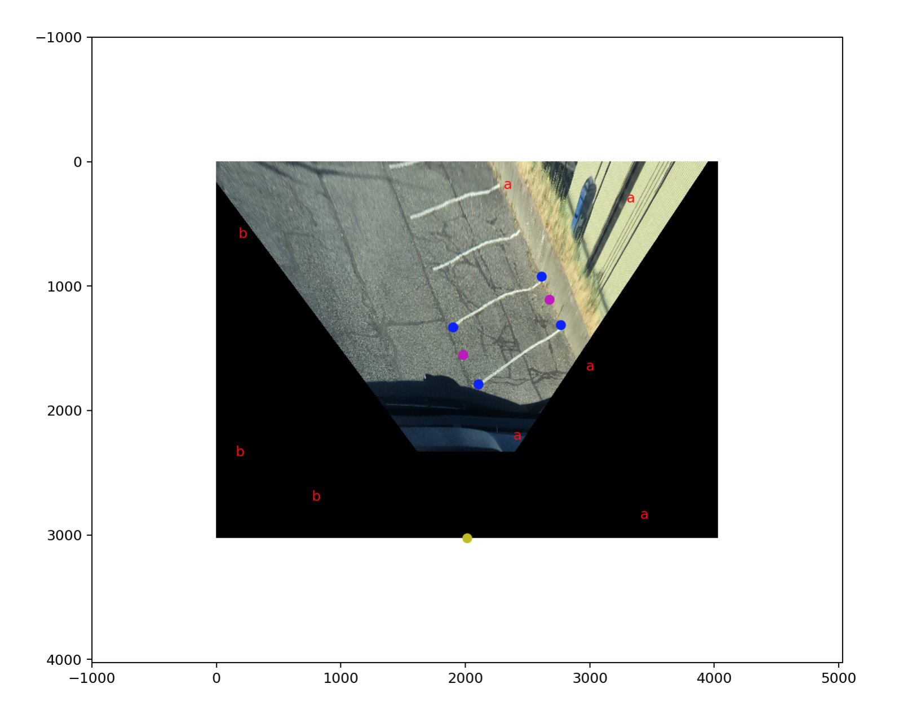
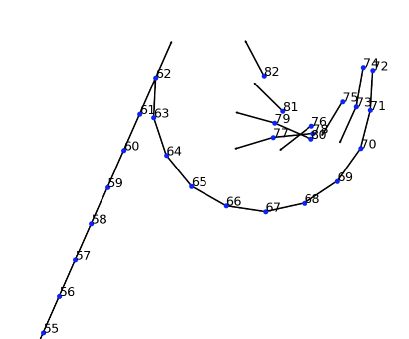
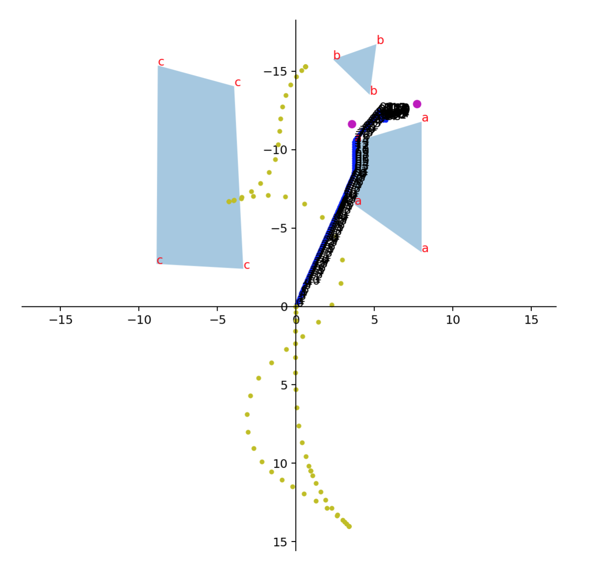

# Mildly Intelligent Parking Assist

Your car may or may not be equipped with an IPA, but now you can have a more mildly intelligent version of it!

### Usage

Run [this](ParkingAssistanceApp.ipynb).

1. Calibrate camera's mounted positioning.
    
1. Approach a parking spot, take a photo, and annotate the parking spot on screen.
    
1. Path is generated.
    
1. Drive along the path, and compare your path vs the derived path in real time.
    

### Requirements

- Comma.ai [Panda](https://comma.ai/shop/). Code can be adopted for any other CAN bus reader.

### Description

With the usability of this prototype improved, this DIY solution has the potential to be more flexible and accurate than a typical commercially available parking assist system today. For example, a typical IPA works for moving in the rear direction only. In contrast, the hybrid-A* algorithm employed here can produce more complex paths for tight spots.

Shoutout to [Udacity](https://www.udacity.com/course/self-driving-car-engineer-nanodegree--nd013) for inspiring this project.

### TODO

- Convert this prototype into a mobile app.
- Make use of proximity sensors, and localize using sensor fusion. (My car doesn't have those sensors.) Currently it uses a forward-pointing camera only.
- Run path generation live. This requires sensor fusion. Take dynamic obstacles (other cars) into consideration.
- The collision avoidance logic in the hybrid-A* is not properly taking ego vehicle's dimension into account.
- Offer multiple choices of destinations: different spots and reverse front/rear orientation.
- Run line detection, to offer suggestion for annotation of parking spots.
- Somehow take ground tilt into account.

And

- Inject CAN bus messsages and make the vehicle drive itself.
